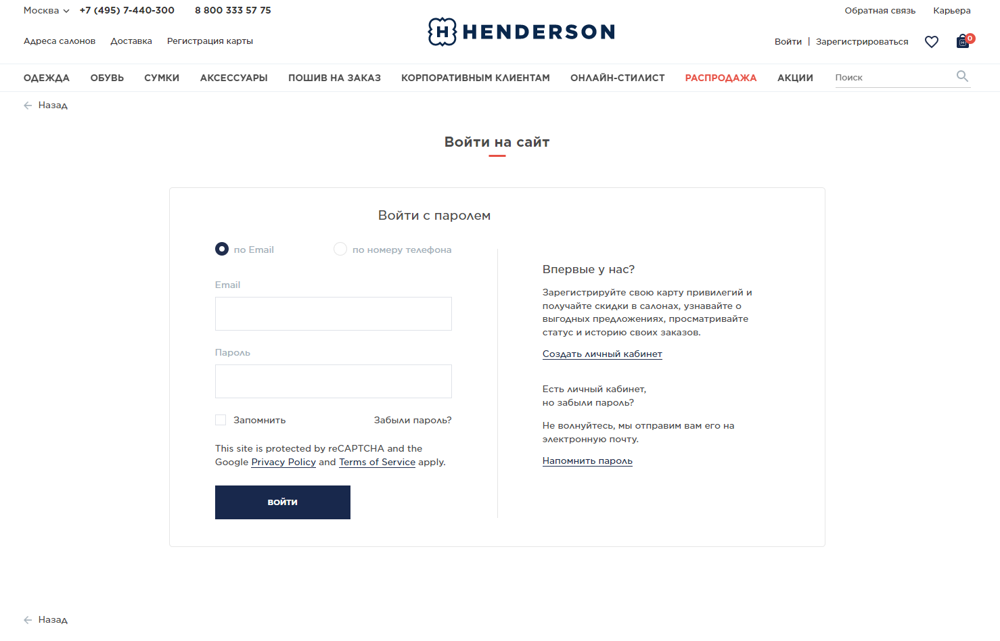
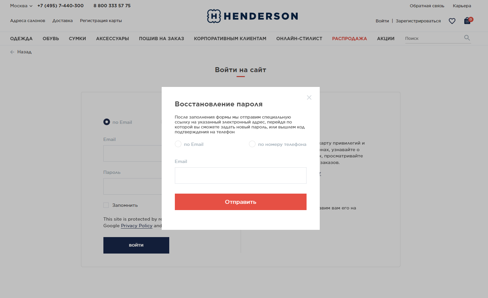
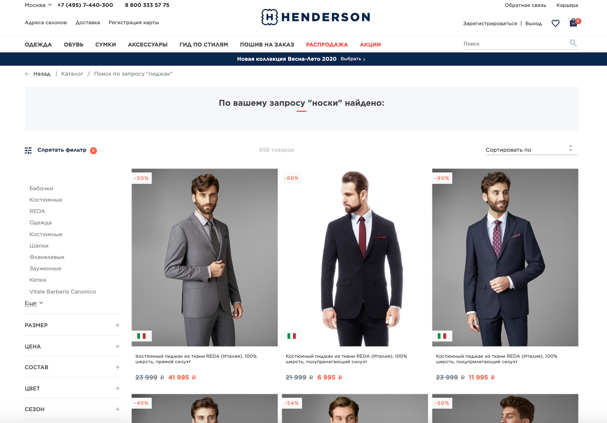
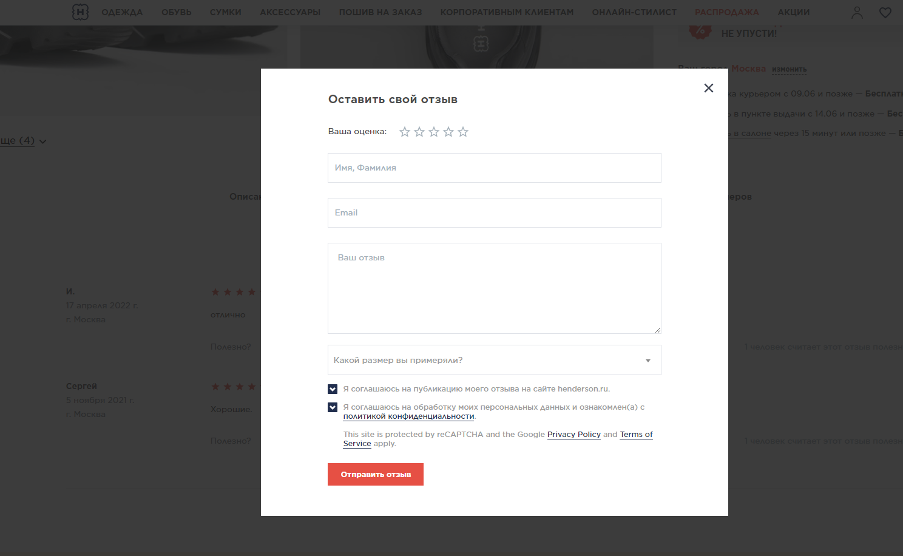

## _Тестирование модулей интернет-магазина [Henderson](https://henderson.ru/)_
___

### _Документация:_

- ***[Чек-лист](https://docs.google.com/spreadsheets/d/169-iLSXHYwdAQtEjf11zfMLYVz3MYA5KpXpc1T_DD18/edit?usp=sharing)***
- ***[Тест-кейсы](https://docs.google.com/spreadsheets/d/1r8aHi79hh7IxssH0jLjMP7O9PDOloXV9OrI7xCdOebE/edit?usp=sharing)***
- ***[Баг-репорты](https://github.com/ValeriyaPolukhina/Task_test_2/issues)***
___

## _Задачи тесирования:_

#### _1. Составить чек-лист для функциональной проверки [личного кабинета зарегистированного авторизованного пользователя](https://henderson.ru/hlogin/) (включая функционал разделов) на сайте [интернет-магазина Henderson](https://henderson.ru/)._

***Скриншот:***

#### _2. Спроектировать набор тест-кейсов для проверки функционала восстановления пароля на сайте интернет-магазина. Тест-кейсы должны покрывать все, что описано в [требованиях](https://drive.google.com/file/d/10YLZB4hOfImnEgFJWsENzPe7wfGkHJ2M/view?usp=sharing) к данному модулю._

***Скриншот:***

#### _3. На основе скриншота обнаружить и задокументировать баги._

***Скриншот:***

#### _4. Найти баги в функционале модуля "Написать отзыв" в карточке товара и задокументировать их._

***Скриншот:***

